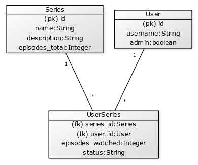

# Tietokantakaavio

Series-taulussa on myös sarake jossa on viiteavaimena sarjan luoneen käyttäjän id. Tiedosta on sinäänsä hyvä pitää kirjaa, mutta sitä ei hyödynnetä sovelluksessa, joten sitä ei ole merkattu kaavioon.
