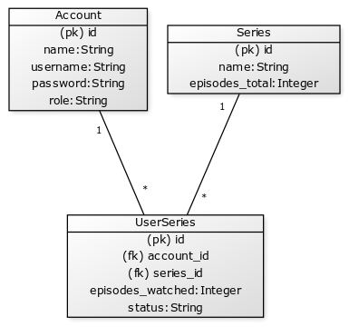

# Tietokantakaavio



Series-taulussa on myös sarake jossa on viiteavaimena sarjan luoneen käyttäjän id. Tiedosta on sinäänsä hyvä pitää kirjaa, mutta sitä ei hyödynnetä sovelluksessa, joten sitä ei ole merkattu kaavioon.

### Tietokannan rakenne:

```SQLite
CREATE TABLE account (
        id INTEGER NOT NULL,
        date_created DATETIME,
        date_modified DATETIME,
        name VARCHAR(144) NOT NULL,
        username VARCHAR(144) NOT NULL,
        password VARCHAR(144) NOT NULL,
        role VARCHAR(144) NOT NULL,
        PRIMARY KEY (id),
        UNIQUE (username)
);

CREATE TABLE series (
        date_created DATETIME,
        date_modified DATETIME,
        id INTEGER NOT NULL,
        name VARCHAR(144) NOT NULL,
        episodes_total INTEGER NOT NULL,
        account_id INTEGER NOT NULL,
        PRIMARY KEY (id),
        FOREIGN KEY(account_id) REFERENCES account (id)
);

CREATE TABLE user_series (
        id INTEGER NOT NULL,
        date_created DATETIME,
        date_modified DATETIME,
        episodes_watched INTEGER NOT NULL,
        status VARCHAR(144) NOT NULL,
        account_id INTEGER NOT NULL,
        series_id INTEGER NOT NULL,
        PRIMARY KEY (id),
        FOREIGN KEY(account_id) REFERENCES account (id),
        FOREIGN KEY(series_id) REFERENCES series (id)
);
```
